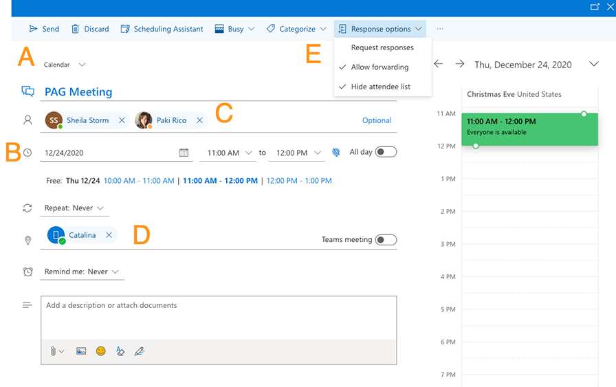

export const Highlight = ({children, color}) => ( {children} );

## Create event in Outlook Calendar

-Create a new event. Best to use the Office 365 version of Outlook in a web browser, as seen in the window below. 
-Select site calendar (A) where you want the event to appear: PAG-Main, RTA-Main (includes RTA & RTAnext), or PAG/RTA-Shared (appears on both sites) 
-Add standard date (B), start/end times, reminder (optional) 
-Add only internal attendees (e.g. committee chair + Sheila) and no external attendees (C). External attendees will be added later, after the event is fully produced. 
-Reserve conference room (D), or select Virtual 
-Go into Response Options (E), select <Highlight color="#1877F2">Hide Attendee List</Highlight> and Allow Forwarding. Leave Request Responses unchecked for virtual meetings and checked if we host the meeting at PAG.  
-Send 

:::note
The <Highlight color="#1877F2">Hide Attendee List</Highlight> is only available using Outlook in Office 365. So you'll need to edit the event using a web browser.
:::

That creates your new meeting/event without making it visible to the public. At this point everything is still private.

## Approvals

Two things require approvals: the associated documents, and the meeting itself. 

-Sheila will deliver approved documents through a separate workflow, and those docs should be attached to the meeting in Outlook. Documents require specific naming convention. [See below](/docs/#document-naming-convention).

-Approval for the meeting as a whole (the final go-ahead) will also come from Sheila. Once approval is given, go into the event in Outlook and add the <Highlight color="#25c2a0">Green</Highlight> category. 

:::note
The sole purpose of the <Highlight color="#25c2a0">Green</Highlight> category is to indicate status, with Green being equivalent to LIVE. If it's Green, it's eligible to be viewed by the public. That's why the category should only be added once past the approvals threshold. Without the Green category it's not eligible and will not appear on the public calendars. There shouldn't be any need to change the category once the docs & event are approved and set to Green.
:::

After <Highlight color="#25c2a0">Green</Highlight> category has been applied, you can start adding external attendees. They will get a copy of the meeting invitation via e-mail along with all subsequent updates to the Outlook event. Make sure you only add them once the event has been fully built, edited, and approved. Attendees get every subsequent update to the meeting/event invitation in Outlook, no matter how minor. So make sure you have 100% sign off on the original pre-event invitation as it is intended to be the only communication sent via Outlook.

The website version of the event will be an exact mirror of the Outlook event pulled automatically via API that has front-end logic looking specifically for items in the <Highlight color="#25c2a0">Green</Highlight> category that are no more than **8 days** in the future. 

## Document naming convention
COMMITTEE ACRONYM YYYY-MM-DD TITLE OF CONTENTS.pdf

Examples: 
RTACAC 2021-01-01 Safety Subelements Handout.pdf 
RTATMC 2020-02-01 Agenda.pdf 
RTACART 2018-03-15 Legal Actions.pdf 
RTABoard 2020-12-01 Item_5A Project Delivery Status Report.pdf 
POPTECH 2019-03-01 Meeting Minutes.pdf 
PAGTIPSUB 2020-06-05 Presentation_1 Slides That Were Shown.pdf

:::warning
Stick to this strict guidline. No extra words, characters, or numerals in the title (e.g. `final_ss`, `030120 UPDATE`, etc.).
Spaces are fine, but no punctuation is allowed except dash (`-`) and underscore (`_`). No exceptions.
:::

## What calendars show on each site?

|        |  PAG-Main Calendar |   RTA-Main Calendar  |   PAG/RTA-Shared Calendar  |
|-------------|--------------------|----------------------|----------------------------|
|   PAG       |          X         |                      |              X             |
|   RTA       |                    |           X          |              X             |
|   RTA Next  |                    |           X          |              X             |